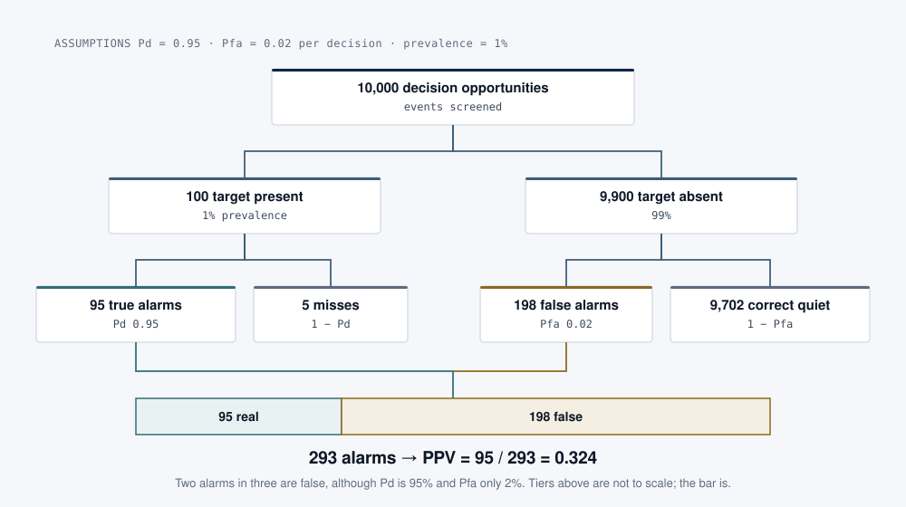

<p align="center">
  
</p>

## What this is

A small, tested Python package and field notes for the statistics of test, evaluation, verification and validation (TEVV). It answers the questions that should be asked before a trial is agreed and after a result is announced: how many runs does a reliability claim need, what interval does 18 out of 20 really support, how many of the alarms will be real at the site's base rate, and what an accuracy figure means when it is a distribution rather than a number. Pure standard library, with a command line interface and tests that reproduce every worked example below.

## Why it matters

Field trials are expensive, so they are small, and small samples lie. A press release that says "90% detection" from 20 approaches is compatible with a true detection rate below 70%. A detector with Pd 0.95 and Pfa 0.02 raises two false alarms for every real one when only 1% of events are threats. Ten clean launches demonstrate about 79% reliability, not 100%. Capability owners sign acceptance on evidence; the arithmetic here separates a demonstration, which shows that something can work, from a characterisation, which shows how often and under which conditions it does.

<p align="center">
  
</p>
<p align="center"><sub><b>Figure 1.</b> The TEVV loop. A requirement stated as task, target, condition, threshold and confidence becomes a protocol written before the data exists. A revalidation trigger (software, model, data or threat change) expires part of the evidence and restarts the loop.</sub></p>

## Quick start

```bash
git clone https://github.com/darkanalytica1/tevv-field-trial-statistics
cd tevv-field-trial-statistics
python -m tevv success-run --reliability 0.90 --confidence 0.90   # 22 runs
python -m tevv interval 18 20                                     # Wilson 0.699 to 0.972
python -m tevv ppv --pd 0.95 --pfa 0.02 --prevalence 0.01         # PPV 0.324
python -m tevv accuracy --csv examples/nav_errors.csv             # CEP50, R95, maximum
```

```text
$ python -m tevv interval 18 20
Wilson: p_hat = 0.900, 95% CI [0.699, 0.972]
Clopper-Pearson: p_hat = 0.900, 95% CI [0.683, 0.988]
Wald: p_hat = 0.900, 95% CI [0.769, 1.000]
```

From Python:

```python
from tevv import success_run_n, demonstrated_reliability, wilson, ppv, ConfusionMatrix

success_run_n(0.95, 0.95)            # 59
demonstrated_reliability(10, 0.90)   # 0.794
wilson(18, 20).as_text()             # 'Wilson: p_hat = 0.900, 95% CI [0.699, 0.972]'
ppv(pd=0.95, pfa=0.02, prevalence=0.01)   # 0.324
ConfusionMatrix(tp=45, fp=5, fn=15).f1    # 0.818 (true negatives not counted)
```

Other commands: `demonstrated` (reliability shown by n clean runs, with the rule of three), `confusion` (precision, recall, F1, Pfa), `trl` (the readiness ladder with evidence gates).

## Method

| Question | Formula | Worked example (tested) |
|---|---|---|
| Runs to demonstrate R at confidence C, zero failures | n = ln(1 − C) / ln R | 90%/90% → 22 runs; 95%/95% → 59; 99%/90% → 230 |
| What n clean runs show | R = (1 − C)^(1/n) | 10 runs at 90% → R ≥ 0.794 |
| Interval on k of n successes | Wilson score | 18/20 → 0.699 to 0.972 |
| Upper bound after zero failures | rule of three, 3/n | 30 flights → 10% (exact 9.5%) |
| Is an alarm real? | PPV = Pd·π / (Pd·π + Pfa·(1 − π)) | Pd 0.95, Pfa 0.02, π 1% → 0.324 |
| False alarms per hour | FAR = Pfa · N_dec | 0.0001 at 3,600/h → 0.36 |
| Accuracy for circular normal error | CEP50 = 1.1774σ, R95 = 2.4477σ | σ 4 m → 4.71 m and 9.79 m |

<p align="center">
  
</p>
<p align="center"><sub><b>Figure 2.</b> The base-rate funnel in natural frequencies. The detector did not get worse between the test set and the site; the prevalence changed.</sub></p>

The full notes, including verification versus validation, TRL evidence gates, demonstration versus characterisation and the twelve-question vendor-claim checklist, are in [docs/METHOD.md](docs/METHOD.md).

## Limitations and assumptions

- **Independence.** Every binomial calculation assumes independent, identically distributed trials in representative conditions. Ten runs over the same patch of ground on one good day are closer to one run repeated than to ten samples. The package cannot detect this; the protocol has to prevent it.
- **Representativeness.** A reliability bound holds only for the conditions sampled. It says nothing about unsampled terrain, weather, operators or software versions.
- **Pfa needs a denominator.** Probability of false alarm is per decision opportunity (per scan, cell or window). Without a stated opportunity rate it cannot be converted into false alarms per hour.
- **Closed-form CEP and R95** hold only for zero-mean, circular normal error. Use the empirical summary for anything real; it measures radii from truth, so bias is included and also reported.
- **The claim checklist** is a reading aid for evidence quality, not a certification method. The TRL evidence column is a synthesis of public guidance, not an official assessment.
- **Example data** in `examples/nav_errors.csv` is synthetic (seeded Gaussian with bias and 4% outliers).

## Tests

```bash
pip install -r requirements.txt
python -m pytest -q      # unit tests and doctests, including every worked example above
```

Python 3.10+. No runtime dependencies. Tests run on GitHub Actions for Python 3.10 to 3.13.

## Sources

Public standards, textbooks and papers only: ISO/IEC/IEEE 15288, NASA SE Handbook, DoDI 5000.89, Mankins (1995) and EU H2020 Annex G on TRL, NIST/SEMATECH e-Handbook, Wilson (1927), Clopper and Pearson (1934), Brown, Cai and DasGupta (2001), Hanley and Lippman-Hand (1983), Fawcett (2006), Swets (1996), the GPS SPS Performance Standard and Groves (2013). Full list in [docs/SOURCES.md](docs/SOURCES.md).

## Licence

MIT. See [LICENSE](LICENSE).

<sub>DarkAnalytica · educational material from public sources and original synthesis.</sub>
